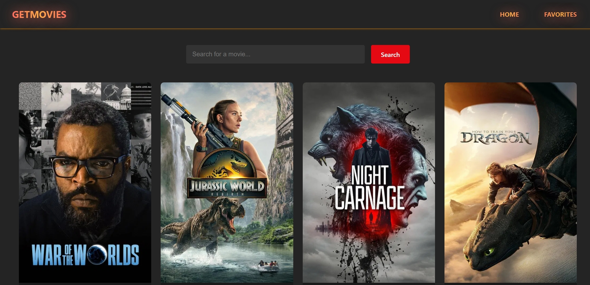
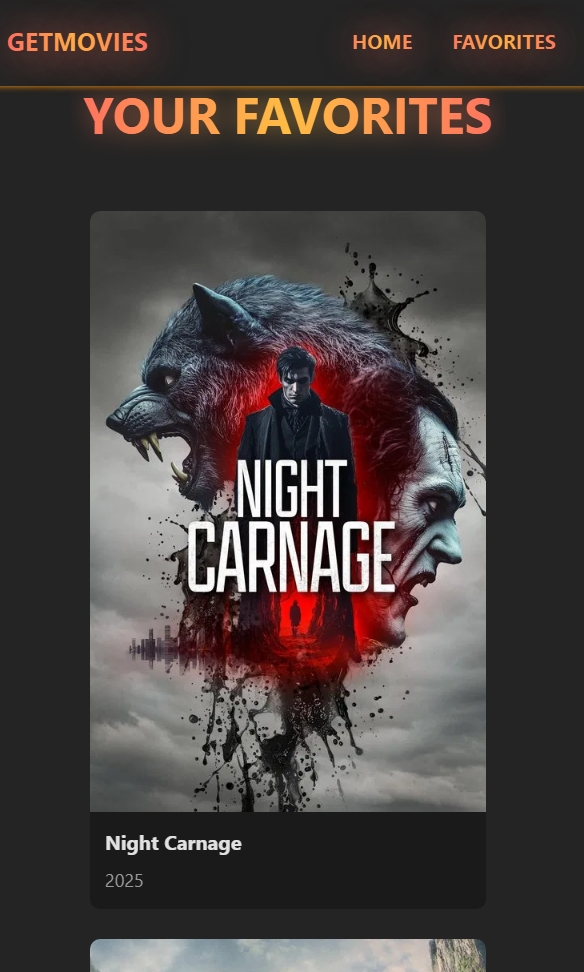
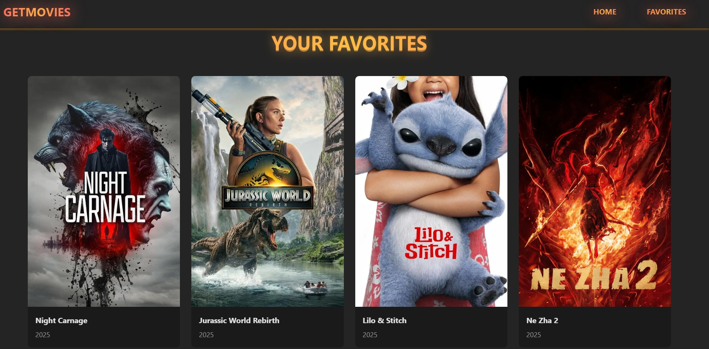
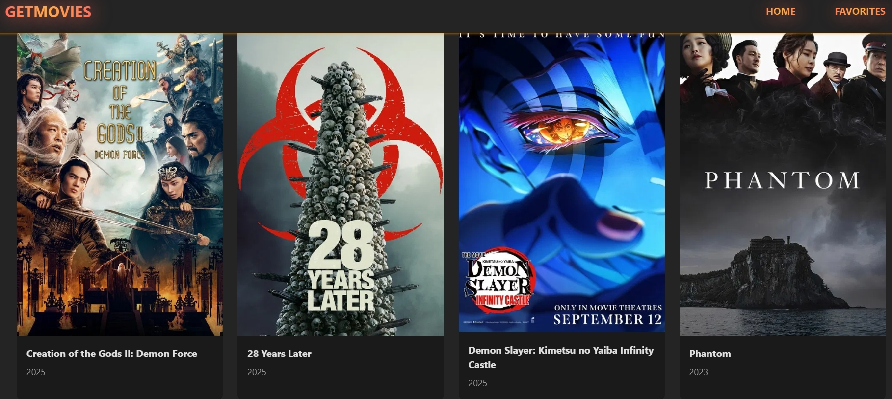

# 🎬 GetMovies App

A modern and responsive **Movie Web Application** built with React that allows users to browse, search, and favorite movies in real-time using data fetched from [The Movie Database (TMDb)](https://www.themoviedb.org/) API.

---

## 🚀 Features

- 🔍 **Search Movies** — Find movies instantly by title.
- 📊 **Browse Categories** — Trending, Top Rated, Upcoming, etc.
- ⭐ **Add to Favorites** — Save your favorite movies with localStorage.
- 🖼️ **Detailed Movie Cards** — Display poster, title, rating, and description.
- ⚡ **Real-time TMDb API Integration**
- 🎨 **Responsive UI** — Mobile-friendly and clean design.

---

## 🛠️ Project Structure

```
movie-app/
├── public/
├── src/
│   ├── assets/         # Static assets (e.g., logos)
│   ├── components/     # Reusable components like MovieCard, Navbar
│   ├── contexts/       # Global state using Context API
│   ├── css/            # Component-specific stylesheets
│   ├── pages/          # Page views (Home, Favorites)
│   ├── services/       # API utility files
│   ├── App.jsx         # Root App component
│   ├── main.jsx        # Entry point
├── .env                # Environment variables (excluded in .gitignore)
├── package.json
├── README.md
```

---

## 🔧 Tech Stack

- **Frontend**: [React.js](https://react.dev/) (with [Vite](https://vitejs.dev/))
- **API**: [TMDb REST API](https://developer.themoviedb.org/docs)
- **State Management**: React Context & Hooks
- **Styling**: CSS Modules / Plain CSS
- **Storage**: localStorage (for persisting favorites)

---

## 📦 Installation

### 1. Clone the repository

```bash
git clone https://github.com/muleseifu/movie-app.git
cd movie-app
```

### 2. Install dependencies

```bash
npm install
```

### 3. Get a TMDb API Key

- Go to the [TMDb API page](https://www.themoviedb.org/settings/api)
- Sign in or create an account
- Copy your **API key (v3 auth)**

### 4. Configure environment variables

Create a `.env` file in the project root:

```env
VITE_TMDB_API_KEY=your_tmdb_api_key_here
```

> ⚠️ Don’t forget to include `.env` in `.gitignore` to keep it secret.

### 5. Run the app locally

```bash
npm run dev
```

Visit: [http://localhost:5173](http://localhost:5173)

---

## ⚠️ Disclaimer

This product uses the TMDb API but is **not endorsed or certified by TMDb**.

---

## 📄 License

This project is open-source and available under the [MIT License](https://choosealicense.com/licenses/mit/).


## An overview






